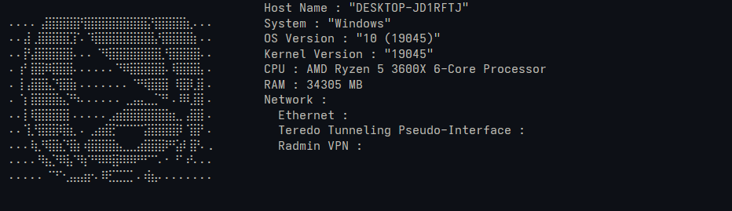
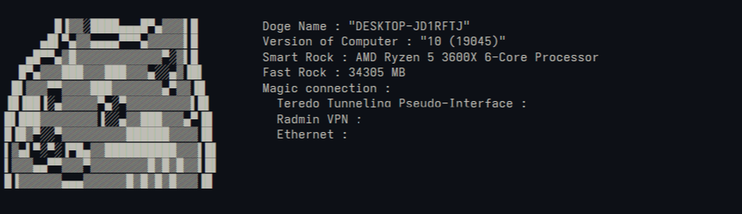

# Nedofetch

This is a small and lightweight neofetch-like application created for learning Rust.



The appearance can be edited using the config file located in the config folder.

---

### Base config:

```toml
img = """
⠄⠄⠄⠄⢠⣿⣿⣿⣿⣿⢻⣿⣿⣿⣿⣿⣿⣿⣿⣯⢻⣿⣿⣿⣿⣆⠄⠄⠄
⠄⠄⣼⢀⣿⣿⣿⣿⣏⡏⠄⠹⣿⣿⣿⣿⣿⣿⣿⣿⣧⢻⣿⣿⣿⣿⡆⠄⠄
⠄⠄⡟⣼⣿⣿⣿⣿⣿⠄⠄⠄⠈⠻⣿⣿⣿⣿⣿⣿⣿⣇⢻⣿⣿⣿⣿⠄⠄
⠄⢰⠃⣿⣿⠿⣿⣿⣿⠄⠄⠄⠄⠄⠄⠙⠿⣿⣿⣿⣿⣿⠄⢿⣿⣿⣿⡄⠄
⠄⢸⢠⣿⣿⣧⡙⣿⣿⡆⠄⠄⠄⠄⠄⠄⠄⠈⠛⢿⣿⣿⡇⠸⣿⡿⣸⡇⠄
⠄⠈⡆⣿⣿⣿⣿⣦⡙⠳⠄⠄⠄⠄⠄⠄⢀⣠⣤⣀⣈⠙⠃⠄⠿⢇⣿⡇⠄
⠄⠄⡇⢿⣿⣿⣿⣿⡇⠄⠄⠄⠄⠄⣠⣶⣿⣿⣿⣿⣿⣿⣷⣆⡀⣼⣿⡇⠄
⠄⠄⢹⡘⣿⣿⣿⢿⣷⡀⠄⢀⣴⣾⣟⠉⠉⠉⠉⣽⣿⣿⣿⣿⠇⢹⣿⠃⠄
⠄⠄⠄⢷⡘⢿⣿⣎⢻⣷⠰⣿⣿⣿⣿⣦⣀⣀⣴⣿⣿⣿⠟⢫⡾⢸⡟⠄.
⠄⠄⠄⠄⠻⣦⡙⠿⣧⠙⢷⠙⠻⠿⢿⡿⠿⠿⠛⠋⠉⠄⠂⠘⠁⠞⠄⠄⠄
⠄⠄⠄⠄⠄⠈⠙⠑⣠⣤⣴⡖⠄⠿⣋⣉⣉⡁⠄⢾⣦⠄⠄⠄⠄⠄⠄⠄⠄
        """
memory = "RAM"
cpu = "CPU"
sysname = "System"
kernelver = "Kernel Version"
osver = "OS Version"
hostname = "Host Name"
network = "Network"

```

To disable any item, simply make the name ""

---

### Example:



```toml
img = """
       █▐▓▓░████▄▄▄█▀▄▓▓▓▌█
     ▄█▌▀▄▓▓▄▄▄▄▀▀▀▄▓▓▓▓▓▌█
   ▄█▀▀▄▓█▓▓▓▓▓▓▓▓▓▓▓▓▀░▓▌█
  █▀▄▓▓▓███▓▓▓███▓▓▓▄░░▄▓▐█▌
 █▌▓▓▓▀▀▓▓▓▓███▓▓▓▓▓▓▓▄▀▓▓▐█
▐█▐██▐░▄▓▓▓▓▓▀▄░▀▓▓▓▓▓▓▓▓▓▌█▌
█▌███▓▓▓▓▓▓▓▓▐░░▄▓▓███▓▓▓▄▀▐█
█▐█▓▀░░▀▓▓▓▓▓▓▓▓▓██████▓▓▓▓▐█
▌▓▄▌▀░▀░▐▀█▄▓▓██████████▓▓▓▌█▌
▌▓▓▓▄▄▀▀▓▓▓▀▓▓▓▓▓▓▓▓█▓█▓█▓▓▌█▌
█▐▓▓▓▓▓▓▄▄▄▓▓▓▓▓▓█▓█▓█▓█▓▓▓▐█
        """
memory = "Fast Rock"
cpu = "Smart Rock"
sysname = ""
kernelver = ""
osver = "Version of Computer"
hostname = "Doge Name"
network = "Magic connection"

```


